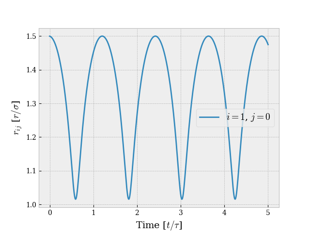
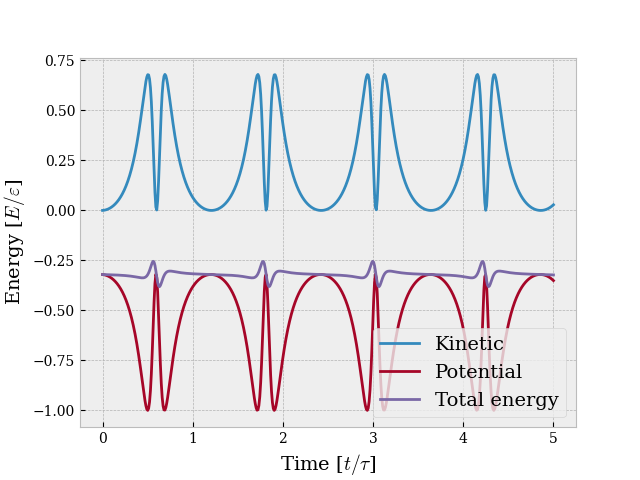

# Two particles moving in one dimension
This example is about two particles that are restricted to move in one dimension. Initially they have no velocity and are separated by a distance 1.5σ, with σ as the characteristic length of the Lennard-Jones potential. The Euler-Chromer integrator is used. Both the cutoff distance and the boundary conditions are set by default, which are 3 and open, respectively. 

The code can be found in ```simulation.py```, and looks like this:
``` python
from mdsolver import MDSolver
from mdsolver.potential import LennardJones
from mdsolver.integrator import EulerChromer
from mdsolver.initpositions import SetPositions

# Simulate two particles in one dimension separated by a distance 1.5 sigma
solver = MDSolver(positions=SetPositions([[0.0], [1.5]]), 
                  T=5, 
                  dt=0.001)
solver(potential=LennardJones(solver), 
       integrator=EulerChromer(solver),
       distance=True,
       dumpfile="2N_1D.data")
solver.plot_distance()
solver.plot_energy()
```
Ensure that ```mdsolver``` is installed before running the code.

## Results
As seen from the code above, the distance and energy are plotted as a function of time. The plots are given below. 



We observe that the two particles oscillate back and fourth, which is natural as the Lennard-Jones potential has a repulsive and an attractive term. The total energy is conserved as expected.
